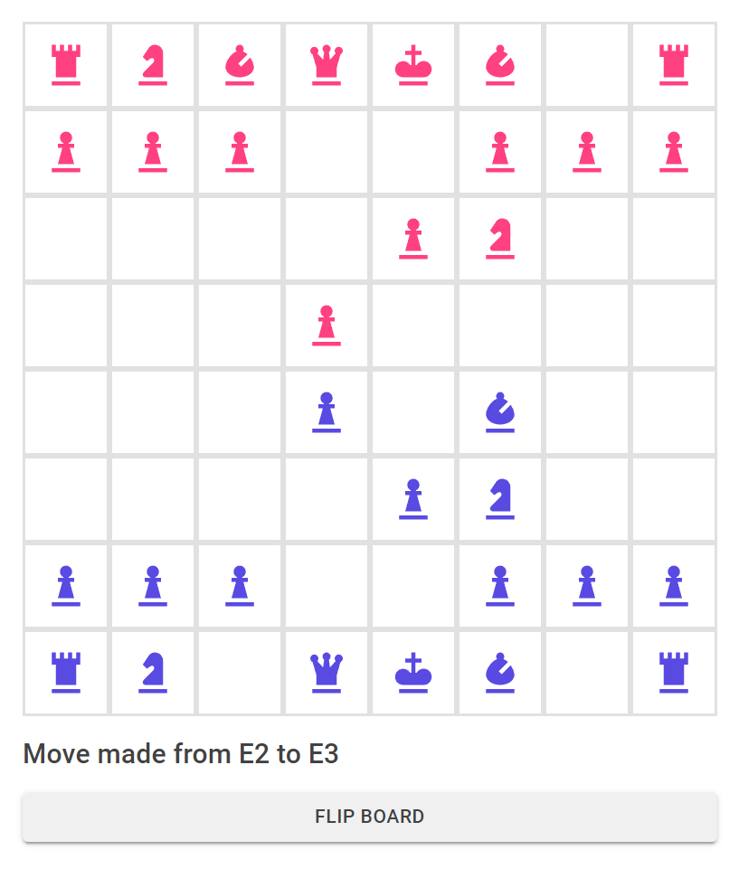

# Unoriginal Chess

    

## Summary

Unoriginal Chess is a work-in-progress chess application built using clean architecture. It provides a console-based view and a GUI view using Blazor WebAssembly. The application is built with clean architecture principles, promoting separation of concerns and testability.

## Usage

To run the console version of Unoriginal Chess, navigate to the `UnoriginalChess.Console` project and execute the program. This will start the application in a console-based view, where you can input moves and see the state of the game.

To run the GUI version of Unoriginal Chess, navigate to the `UnoriginalChess.Wasm` project and run the project. This will start the Blazor WebAssembly application, allowing you to interact with the chessboard through a graphical user interface.

## Project Structure

The project follows a modular structure with the following components:

- `UnoriginalChess.Entities`: Contains the core entities and value objects for the chess game, such as `Piece`, `Player`, `Board`, etc.
- `UnoriginalChess.Application`: Contains the use cases and interfaces for the application. It defines the input and output ports, which serve as the boundaries for interacting with the application. Use cases encapsulate the business logic and orchestrate the flow of data between the entities and the application services.
- `UnoriginalChess.Console`: Implements the console-based view of the application. It handles user input and displays the game state in the console.
- `UnoriginalChess.Wasm`: Implements the GUI view of the application using Blazor WebAssembly. It provides a web-based interface for interacting with the chessboard.
- `UnoriginalChess.UnitTests`: Contains unit tests for the application's components to ensure correctness and reliability.
